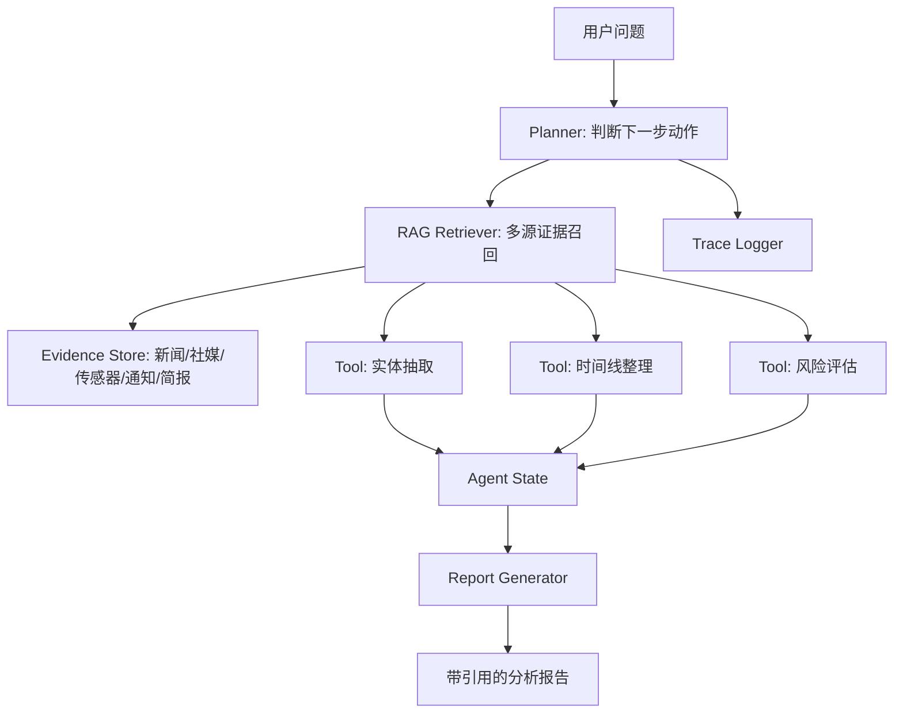

# 多源情报 RAG 分析 Agent

[](https://www.python.org/)
[](https://fastapi.tiangolo.com/)
[](LICENSE)

面向安全态势分析的 RAG + Tool Calling Agent。系统从公开新闻、社交媒体、传感器日志、内部通知和分析员简报中检索证据，再调用实体抽取、时间线整理、风险评估和报告生成工具，输出带引用来源的结构化研判报告。

这个项目的目标不是做一个普通聊天机器人，而是展示 Agent 工程中的完整闭环：**检索证据、调用工具、维护状态、记录 trace、输出可审计报告**。

## 项目亮点

| 能力 | 设计 |
|---|---|
| 多源 RAG | 将新闻、社媒、雷达日志、内部通知和简报统一切分成 evidence chunk |
| Tool Calling | 实体抽取、时间线整理、风险评估、报告生成都是独立工具 |
| 可追溯报告 | 每个结论都带证据编号、来源、来源类型和置信度 |
| 工程可交付 | 提供 CLI、FastAPI、Docker、测试、API 文档和部署说明 |
| 面试可讲 | 文档中包含架构图、项目讲述稿、常见追问回答和可扩展方案 |

## 快速开始

不安装依赖也可以运行 CLI 演示：

```bash
cd 01_multi_source_intelligence_rag_agent
python3 -m src.app.cli --question "北岭港东侧堤坝无人机活动是否异常？请说明证据和风险。"
```

启动 API：

```bash
python3 -m venv .venv
source .venv/bin/activate
pip install -e ".[dev]"
uvicorn src.app.main:app --reload --port 8010
```

打开接口文档：

```text
http://127.0.0.1:8010/docs
```

## API 示例

```bash
curl -X POST http://127.0.0.1:8010/ask \
  -H "Content-Type: application/json" \
  -d '{"question":"北岭港夜间低空目标是否代表安全风险？", "top_k": 6}'
```

## 项目结构

```text
01_multi_source_intelligence_rag_agent/
├── src/app/
│   ├── main.py          # FastAPI 入口
│   ├── cli.py           # 命令行演示入口
│   ├── agent.py         # Agent 编排流程
│   ├── retriever.py     # 关键词/BM25 风格检索
│   └── tools.py         # 实体、时间线、风险、报告工具
├── data/                # 多源模拟情报资料
├── docs/                # 架构、API、部署、复现、面试稿
├── tests/               # 核心流程测试
├── Dockerfile
├── docker-compose.yml
├── Makefile
├── pyproject.toml
└── RELEASE_CANDIDATE_MANIFEST.md
```

## 架构图



## 已知局限

- 当前默认使用标准库实现轻量检索，便于离线演示；生产版建议替换为 Embedding + FAISS/Chroma + Reranker。
- 当前风险评分是规则模型；真实落地应加入人工复核、冲突证据检测和阈值配置。
- 样例数据为模拟数据，不代表真实安全事件。

## 可扩展方向

- 接入网页/文件上传，多源数据自动入库。
- 引入向量库、重排序模型和证据充足性判断。
- 将实体抽取替换为 LLM Function Calling 或 NER 模型。
- 加入 LangSmith/OpenTelemetry trace、评测集和回归测试。
